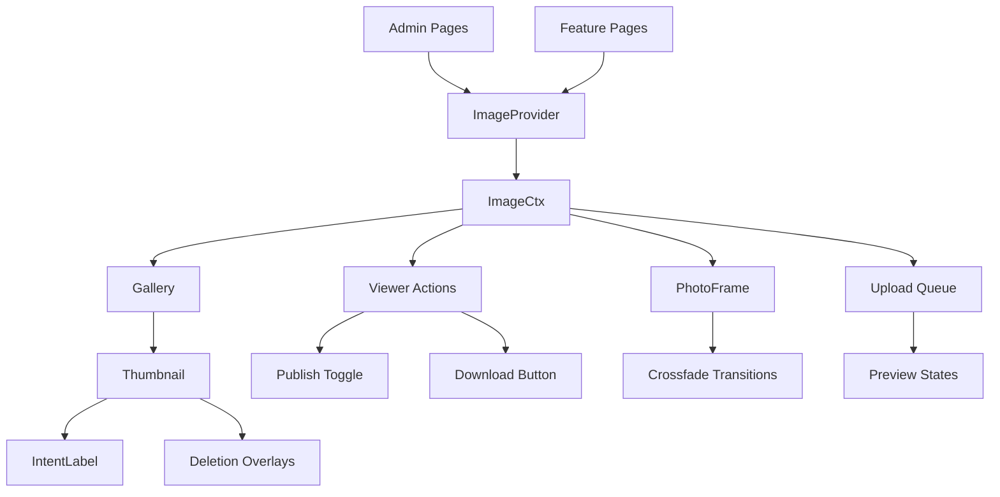

# Image System Architecture

## Overview

The image system in Hype manages the display, upload, and manipulation of images across various contexts (features, projects, organizations, tasks). The system is built around a centralized `ImageCtx` class that provides reactive state management using Svelte 5's `$state` and coordinates between multiple components.

## Core Components

### ImageCtx (`src/lib/context/image.svelte.ts`)

The central reactive state management class that handles:

- **Image Loading & Caching**: Fetching images from API with cache fallback
- **Upload Management**: Coordinating file uploads with preview states
- **Gallery Navigation**: Handling image carousels and smooth transitions
- **Intent Management**: Managing image intent (canonical, context, etc.)
- **Publish State**: Managing published/unpublished status with reactive updates
- **Deletion Workflow**: Handling image deletion with confirmation states

#### Key State Properties

```typescript
state = $state({
  // Core image data
  images: new Map<Id, ImageDB>(),
  activeImage: null as Image | null,
  targetImage: null as Image | null,

  // Upload management
  uploadQueue: [] as ImageUpload[],
  activePreview: null as ImageUpload | null,

  // Status tracking
  loadStatus: new Map<Id, LoadStatus>(),
  thumbnailLoadStatus: new Map<Id, LoadStatus>(),
  errorMessages: new Map<Id, { message: string; timestamp: number }>(),

  // Interaction states
  pendingConfirmation: new Set<Id>(),
  deletionQueue: new Set<Id>(),
  highlightedIds: [] as Id[],

  // Context configuration
  context: null as ImageContextConfig | null,
  lastChangeType: null as 'target' | 'nav' | 'context' | null
});
```

#### Key Reactive Derived States

```typescript
// Determines current viewer state based on active image and uploads
viewerState = $derived.by(() => {
  // Returns: 'empty' | 'complete' | 'previewUploading' | 'previewReplacement'
});

// Provides sorted images for gallery display
getImages(): ImageDB[] {
  return Array.from(this.state.images.values());
}
```

#### Critical Methods

- `setContext(options)`: Initialize image context for a specific resource
- `target(imageId)`: Switch to specific image with smooth transitions
- `handlePublishToggle()`: Toggle publish status with proper reactivity
- `handleSetIntent(imageId, intent)`: Update image intent with re-sorting
- `setForImage(imageId, key, value)`: Update image properties with reactivity
- `addToUploadQueue(files)`: Add files to upload queue with previews

### ImageProvider (`src/lib/components/providers/ImageProvider.svelte`)

A wrapper component that initializes and provides `ImageCtx` to child components.

```svelte
<ImageProvider
  isAdminMode={true}
  image={feature.image}
  images={feature.images}
  context={{
    ctxType: ImageContextResource.feature,
    ctxId: feature.id,
    organisation: feature.organisation,
    project: feature.project
  }}>
  <!-- Child components that need image context -->
</ImageProvider>
```

### PhotoFrame (`src/lib/components/common/PhotoFrame.svelte`)

The core image display component with smooth crossfade transitions:

```typescript
// Smart crossfade logic
let baseImage = $state<Image | null>(null);
let overlayImage = $state<Image | null>(null);
let overlayOpacity = $state(0);

// Handles transition interruption
if (isTransitioning && overlayImage) {
  baseImage = overlayImage; // Current overlay becomes new base
}
```

### Gallery System

#### Gallery (`src/lib/components/images/gallery/Gallery.svelte`)

Main gallery container with:

- Horizontal scrolling with mouse wheel hijacking
- Auto-scroll to active image
- Smooth scroll arrows
- Drag & drop integration

#### Thumbnail (`src/lib/components/images/gallery/Thumbnail.svelte`)

Individual thumbnail component with:

- Reactive publish status (70% opacity for unpublished)
- Loading states with proper status tracking
- Error overlays for deletion failures
- Intent labels with proper z-index stacking

```typescript
// Reactive publish status
let isPublished = $derived.by(() => {
  const contextImage = imageCtx.getImage(image.id);
  return contextImage?.isPublished ?? image.isPublished;
});
```

#### IntentLabel (`src/lib/components/images/IntentLabel.svelte`)

Intent selection component with:

- Reactive intent display from context
- Dropdown selection for changing intent
- Proper z-index (z-20) to appear above thumbnails
- Focus management and keyboard navigation

## Image Upload Workflow

### 1. File Selection & Preview

```typescript
// Create preview URL for immediate display
const preview = URL.createObjectURL(file);
const upload: ImageUpload = {
  id: nanoid(),
  file,
  preview,
  status: 'pending',
  imageToReplace?: existingImage // For replacement uploads
};
```

### 2. Upload Queue Management

```typescript
// Add to upload queue
imageCtx.addToUploadQueue(files, imageToReplace);

// Process uploads with status tracking
await imageCtx.processUploadQueue({
  onSuccess: (savedImage) => {
    // Handle successful upload
  },
  onError: () => {
    // Handle upload failure
  }
});
```

### 3. Viewer State During Upload

The system maintains different viewer states:

- `empty`: No images available
- `complete`: Showing database image
- `previewUploading`: Showing preview while uploading new image
- `previewReplacement`: Showing preview while replacing existing image

## Reactivity Architecture

### Svelte 5 State Management

The system uses Svelte 5's reactive primitives:

```typescript
// Reactive state
state = $state({ ... });

// Derived computations
viewerState = $derived.by(() => { ... });

// Reactive updates
setForImage(imageId: Id, key: keyof Image, value: any) {
  const image = this.getImage(imageId);
  if (!image) return;

  // Create new object to trigger reactivity
  const updatedImage = { ...image, [key]: value };
  this.state.images.set(imageId, updatedImage as ImageDB);

  // Update activeImage if it's the same image
  if (this.state.activeImage?.id === imageId) {
    this.state.activeImage = updatedImage as Image;
  }
}
```

### Component Reactivity

Components use `$derived.by()` for complex reactive computations:

```typescript
// In Thumbnail.svelte
let isPublished = $derived.by(() => {
  const contextImage = imageCtx.getImage(image.id);
  return contextImage?.isPublished ?? image.isPublished;
});

// In Viewer.svelte
let isPublished = $derived.by(() => {
  if (!activeImage) return false;
  const contextImage = imageCtx.getImage(activeImage.id);
  return (contextImage as any)?.isPublished ?? activeImage.isPublished ?? false;
});
```

## Image Sorting & Prioritization

### Sorting Logic (`src/lib/api/services/image.ts` & `src/lib/client/services/image.ts`)

Images are sorted by priority:

1. **Unpublished with no intent** (highest priority)
2. **Published images** (by intent order)
3. **Unpublished images** (by intent order)
4. **Creation date** (newest first)

```typescript
export function sortImages(images: Image[]): Image[] {
  return images.sort((a, b) => {
    // Priority 1: Unpublished + no intent
    const aIsUnpublishedNoIntent =
      !a.isPublished && (!a.intent || a.intent === 'undefined');
    const bIsUnpublishedNoIntent =
      !b.isPublished && (!b.intent || b.intent === 'undefined');

    if (aIsUnpublishedNoIntent && !bIsUnpublishedNoIntent) return -1;
    if (!aIsUnpublishedNoIntent && bIsUnpublishedNoIntent) return 1;

    // Priority 2: Published vs unpublished
    if (a.isPublished && !b.isPublished) return -1;
    if (!a.isPublished && b.isPublished) return 1;

    // Priority 3: Intent order
    const aIntentIndex = intentOrder.indexOf(a.intent as Intent);
    const bIntentIndex = intentOrder.indexOf(b.intent as Intent);
    if (aIntentIndex !== bIntentIndex) return aIntentIndex - bIntentIndex;

    // Priority 4: Creation date
    return new Date(b.createdAt).getTime() - new Date(a.createdAt).getTime();
  });
}
```

## Error Handling

### Deletion Errors

The system handles deletion constraints gracefully:

```typescript
// Server-side error detection
if (error.message.includes('FOREIGN KEY constraint failed')) {
  if (error.message.includes('taskImage.imageId')) {
    return error(400, 'Cannot delete image. It belongs to a Task');
  }
}

// Client-side error display
this.setErrorMessage(imageId, errorMessage);
// Auto-clear after 5 seconds
setTimeout(() => this.clearErrorMessage(imageId), 5000);
```

### Deletion Order

Critical: Delete from database first, then Cloudinary:

```typescript
// 1. Delete from database (stops UI from trying to load)
await deleteImageFromDatabase(imageId);

// 2. Delete from Cloudinary (with error handling)
try {
  await deleteImageFromCloudinary(publicId);
} catch (error) {
  // Cloudinary deletion failures don't roll back database changes
  console.error('Cloudinary deletion failed:', error);
}
```

## Navigation & Transitions

### Smooth Image Transitions

The system provides smooth transitions between images:

```typescript
// Navigation with preloading
async switchToImageSmooth(targetImage: Image) {
  // Preload target image
  await this.preloadImageForTransition(targetImage);

  // Set as target for transition
  this.setTargetImage(targetImage);
  this.state.lastChangeType = 'nav';

  // PhotoFrame handles the crossfade
}
```

### Gallery Navigation

- **Click zones**: 50px wide zones on left/right of viewer
- **Visual feedback**: Arrows with backdrop blur on hover
- **Z-index hierarchy**: Navigation (z-20) > Actions (z-10)
- **Auto-scroll**: Gallery scrolls to keep active image visible

## Context Types & Configuration

### Feature Context

```typescript
{
  ctxType: ImageContextResource.feature,
  ctxId: feature.id,
  organisation: feature.organisation,
  project: feature.project
}
```

### Extended Context (for Tasks)

```typescript
{
  ctxType: ImageContextResource.feature,
  ctxId: feature.id,
  ctxTypeSecondary: ImageContextResource.task,
  ctxIdSecondary: task.id,
  organisation: feature.organisation,
  project: feature.project
}
```

## Component Architecture



## Recent Fixes & Improvements

### Reactivity Fix for Publish Toggle

**Problem**: Publish toggle worked once but not on subsequent toggles
**Solution**: Fixed `setForImage` to create new objects instead of mutating

```typescript
// Before (broken reactivity)
(image as any)[key] = value;

// After (proper reactivity)
const updatedImage = { ...image, [key]: value };
this.state.images.set(imageId, updatedImage as ImageDB);
```

### Intent Label Visibility

**Problem**: Intent labels hidden by z-index conflicts
**Solution**: Proper z-index hierarchy and removed removeMode condition

```typescript
// Intent labels always visible with z-20
class="absolute bottom-0 left-0 right-0 z-20 flex justify-center p-2"
```

### Gallery Performance

**Problem**: Extensive debug logging affecting performance
**Solution**: Removed ~30+ console.log statements from ImageCtx

### Crossfade Transitions

**Problem**: Weird scale/pop-in effects during transitions
**Solution**: Proper crossfade with overlay opacity management

```typescript
// Smart transition interruption
if (isTransitioning && overlayImage) {
  baseImage = overlayImage; // Current overlay becomes new base
}
```

## Usage Patterns

### Basic Admin Image Display

```svelte
<ImageProvider
  isAdminMode={true}
  image={feature.image}
  images={feature.images}
  context={{
    ctxType: ImageContextResource.feature,
    ctxId: feature.id,
    organisation: feature.organisation,
    project: feature.project
  }}>
  <div class="flex gap-6">
    <!-- Main viewer -->
    <div class="flex-1">
      <PhotoFrame />
      <ViewerActions />
    </div>

    <!-- Gallery sidebar -->
    <div class="w-64">
      <Gallery />
    </div>
  </div>
</ImageProvider>
```

### Gallery with Upload

```svelte
<Gallery hasDropzone={true} inputElement={fileInput} />
```

### Task Review Interface

```svelte
<ImageProvider
  context={{
    ctxType: ImageContextResource.feature,
    ctxId: task.feature.id,
    ctxTypeSecondary: ImageContextResource.task,
    ctxIdSecondary: task.id,
    organisation: task.organisation,
    project: task.project
  }}>
  <!-- Shows both feature images and task-specific images -->
</ImageProvider>
```

## Best Practices

### 1. Always Use Proper Context

Ensure ImageProvider receives proper context configuration with all required properties.

### 2. Handle Reactive Updates

Use `$derived.by()` for complex reactive computations that depend on context state:

```typescript
let isPublished = $derived.by(() => {
  const contextImage = imageCtx.getImage(image.id);
  return contextImage?.isPublished ?? image.isPublished;
});
```

### 3. Manage Z-Index Hierarchy

- Navigation zones: z-20
- Intent labels: z-20
- Error overlays: z-30
- Actions: z-10
- Content: z-0 to z-1

### 4. Handle Upload States

Provide proper UI feedback for all upload states and handle errors gracefully.

### 5. Deletion Order

Always delete from database first, then external services to prevent UI inconsistencies.

## Troubleshooting

### Common Issues

**Publish Toggle Not Working**

- Cause: Direct object mutation not triggering reactivity
- Solution: Use `setForImage` method which creates new objects

**Gallery Not Updating**

- Cause: Thumbnail reactivity not connected to context
- Solution: Use `$derived.by()` with `imageCtx.getImage()`

**Crossfade Transitions Choppy**

- Cause: Transition interruption not handled
- Solution: Implement smart base image switching

**Upload Previews Not Showing**

- Cause: Missing preview URL or incorrect viewer state
- Solution: Ensure `URL.createObjectURL()` and proper state management

**Deletion Failures**

- Cause: Foreign key constraints or wrong deletion order
- Solution: Check constraints and delete database first
